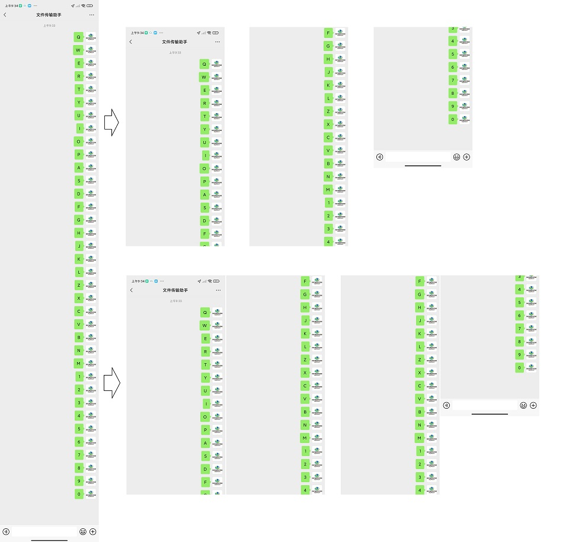
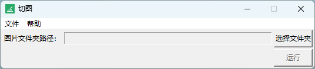

# 微信聊天记录长图切割

将微信聊天记录长截图进行切割，除第一张切图外，其余切图包含上张切图的后几句聊天记录，支持2种格式，单张或双张切图。


## 依赖

> pillow

> tkinter

## 运行

```
python main.py
```



选择长截图所在文件夹，点击运行即可。
程序会遍历所选文件夹下的所有图片，对其进行截图，结果保存在所选文件夹下的所选图片同名的文件夹下，按顺序进行编号。

## 配置
参见config.json
```json
{
    "图片高度": 2400,
    "重复高度": 200
}
```

## 打包
```
pyinstaller -F -w -i .\favicon.ico -n 切图 .\main.py
```